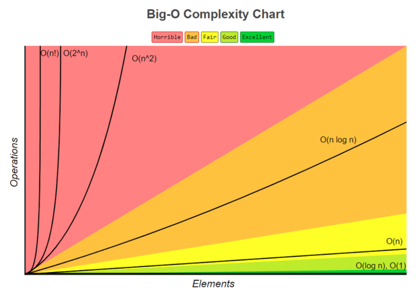

# 개인 알고리즘 스터디 Repository
알고리즘을 공부하며 풀었던 문제들을 기록하기 위한 공간입니다.

아래 글은 알고리즘 이론 정리 내용입니다.

<br>

## 알고리즘 필수 개념
✔️ *시간복잡도란(time complexity)란?*

함수의 <U>실행 시간</U>을 표현하는것

주로 <U>점근적 분석</U> 을 통해 실행시간을 단순하게 표현하며 이 때 <U>점근적 표기법</U>으로 표현한다.

***실행시간***, ***점근전 분석***, ***점근적 표기법*** 용어 이해를 위한 예제 코드
 ``` java
public int multitply(int[] inputs, int multipler){
    int[] nums = new int[inputs.length];
    for(int i=0; i<inputs.length; i++){
        nums[i] = inputs[i] * multipler;
    } 
}
```

이 메서드는 반복문을 활용해 파라미터로 전달받은 값을 곱해서 배열의 값을 세팅하는 코드이다.

이 함수의 **실행시간**이 어느 정도인지를 어떻게 표현할 것인가?

<br>

✔️  *실행시간*

함수/ 알고리즘 수행에 필요한 스텝 수를 의미한다.

(N = size of inputs)

위 코드의 실행시간을 표현하면 `a*N + b` 이다.  
(계산 과정에 대한 상세 내용이 궁금하면 아래 링크 <U>쉬운코딩</U>님 영상를 보고오자)

<br>

✔️  *점근전분석*

`실행시간`에서 N이 커질수록 덜 중요한 것은 제거, `최고차항` 으로 표현하는 분석법

또한 점근적 표기법에는 3가지의 표기법이 있다.

1. 빅오 표기법 : <U>최악의 상황</U>을 고려하여 성능 측정 결과 표현
2. 세타 표기법 : <U>평균적인 경우</U>에서의 성능 측정 결과 표현
3. 오메가 표기법 : <U> 최선의 상황</U>일 때의 성능 측정 결과 표현

우리가 일반적으로 말하는 시간복잡도는 빅오(O) 표기법을 사용한 것입니다.

아래 그림도 시간복잡도를 빅오 표기법을 사용해 표기된 그림입니다.



---

## 예제 코드
시간복잡도를 이해하기 위해 흔히 사용하는 예제 코드가 어떤 시간복잡도를 가지고 있는지 보겠습니다.

<br>

***1. O(1)***
``` java
public int example(int n){
    int a = 2; //1회
    int multiplyA = 2 * a;  //1회
    return multiplyA; //1회
}
```
위 예제는 각각 1회씩, 총 3회의 코드가 실행됩니다.

3--> ***O(1)*** 로 표기할 수 있습니다.

<br>

***2. O(N)***
``` java
public int exmaple2(int[] arr, int n){
    int sum = 0; // 1회
    for(int i=0; i<n; i++){ //n회 
        sum += i;
    }
    return sum;// 1회
}
```
for문이 하나 있어 반복문 사용부분에서 n회 코드가 반복 실행됩니다.
따라서 n + 2 --> ***O(N)*** 으로 표시합니다.

<br>

***3.O(N^2)***
``` java
public int[][] example3(int[][] arr, int n){
    
    int row =arr.length; // 1회
    int col =arr[0].length; // 1회

    int[][] multiplyArray = new int[row][col]; 
    for(int i=0; i<row; i++){
        for(int j=0; j<col; j++){
            multiplyArray[i][j] = arr[i][j] * 2;
        } // n^2회 실행
    }

    return multiplyArray; // 1회
}

```
이제 어느정도 감이 오는듯하다. 

3 + n^2 => ***O(N^2)*** 으로 표시된다.

위 그림을 보면 이중포문은 시간복잡도가 매우 증가함을 알 수 있다.

<br>

***4. O(log N)***
``` java
private static int binarySearch(int[] array, int target){

    int left = 0;
    int right = array.length - 1;

    while(left <= right){
        int mid = left +  (left + right) / 2; // 오버 플로우 방지를 위함

        if(array[mid] == target){
            return mid;
        }

        if(array[mid] < targetr){
            left = mid + 1; 
        } else if(array[mid] > target) {
            right = mid - 1; 
        }

    }   
    return -1;// 찾고자 하는 값이 없음.
}

```
***O(log N)*** 의 시간복잡도를 가지는 대표 이진탐색 코드이다. 일반 반복문보다 확실히 성능이 우수한것을 확인할 수 있다.

<br>

**정리**
- 알고리즘의 시간초과를 이해하기 위해선 내가 작성한 코드가 어떤 시간복잡도를 가지고 있는지 알야아한다.
- 나아가 시스템 성능에 유리한 코드를 구성하려면 다양한 유형의 문제와 사람들의 코드를 만나보는게 중요하다 생각된다. 

---

## 활용 알고리즘 플랫폼 사이트 
1. [프로그래머스](https://programmers.co.kr/)
2. [해커랭크](https://www.hackerrank.com/)
3. [인프런](https://www.inflearn.com/)
4. [백준](https://www.acmicpc.net/)
5. [리트코드](https://leetcode.com/)

--- 

## 참고한 내용
- [쉬운코딩 - 시간복잡도](https://www.youtube.com/watch?v=tTFoClBZutw)

- [시간복잡도 그림 출처 및 예제 코드 참고 velog](https://velog.io/@mangozoo20/%EA%B8%B0%EB%B3%B8-%EC%95%8C%EA%B3%A0%EB%A6%AC%EC%A6%98-%EC%9D%B4%EB%A1%A0-%ED%94%84%EB%A1%9C%EA%B7%B8%EB%9E%98%EB%B0%8D)
